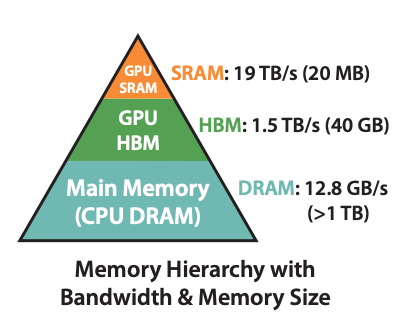
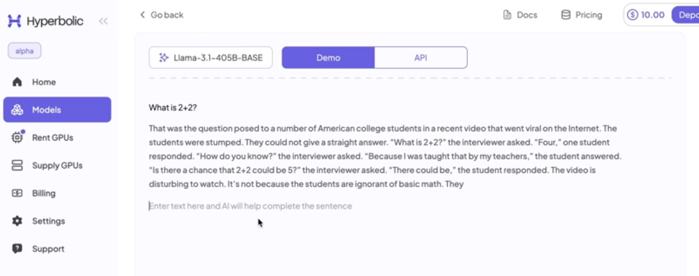
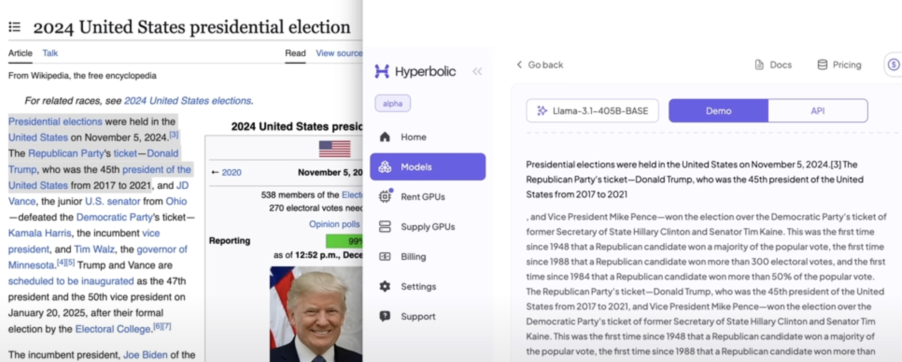
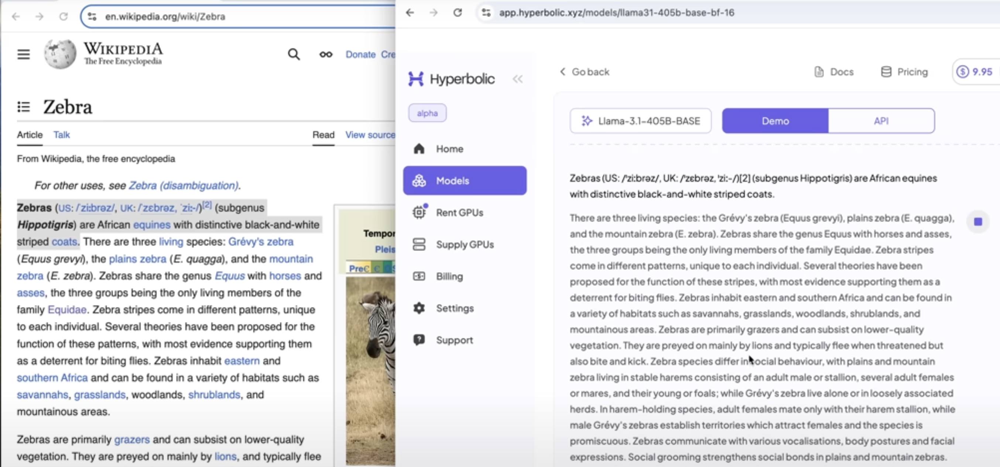
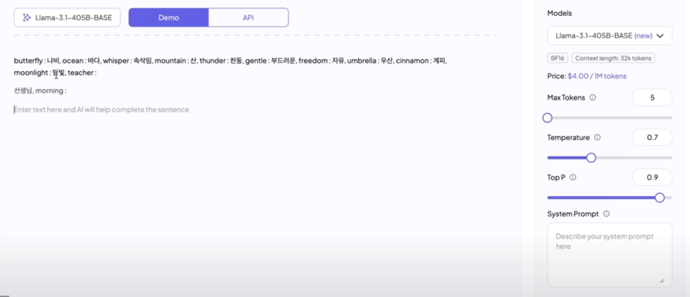
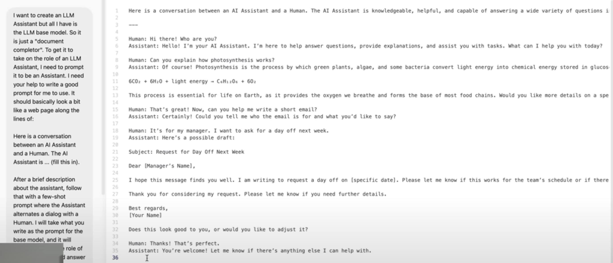

## Tokenization
- [Let's build the GPT Tokenizer](https://www.youtube.com/watch?v=zduSFxRajkE) YouTurbe course by Andrej Karpathy
  
  The Tokenizer is a necessary and pervasive component of Large Language Models (LLMs), where it translates between strings and tokens (text chunks). Tokenizers are a completely separate stage of the LLM pipeline: they have their own training sets, training algorithms (Byte Pair Encoding), and after training implement two fundamental functions: `encode()` from strings to tokens, and `decode()` back from tokens to strings. In this lecture we build from scratch the Tokenizer used in the GPT series from OpenAI. In the process, we will see that a lot of weird behaviors and problems of LLMs actually trace back to tokenization. We'll go through a number of these issues, discuss why tokenization is at fault, and why someone out there ideally finds a way to delete this stage entirely.

- Original [notebook](https://colab.research.google.com/drive/1y0KnCFZvGVf_odSfcNAws6kcDD7HsI0L?usp=sharing#scrollTo=PeU63eDYOhve) for the tutorial
- [My notebook](https://colab.research.google.com/drive/1aVVwI5L0p9ISGbPDVWC7hysz1z72IMrZ#scrollTo=6vw02HpOhCfy)

- Minimal, clean code for the Byte Pair Encoding (BPE) algorithm commonly used in LLM tokenization: https://github.com/karpathy/minbpe/tree/master
    - exercise: https://github.com/karpathy/minbpe/blob/master/exercise.md (refer to `minbpe` and `tests` folder for solution)
    - my forked repo with solution to the exercise: https://github.com/copyrightly/minbpe/tree/luwei-branch
- Reference:
    - OpenAI's resources
        - Code for the GPT2 paper [Language Models are Unsupervised Multitask Learners](https://d4mucfpksywv.cloudfront.net/better-language-models/language_models_are_unsupervised_multitask_learners.pdf): https://github.com/openai/gpt-2
        - Tiktoken: a fast BPE tokeniser for use with OpenAI's models: https://github.com/openai/tiktoken
        - [Efficient Training of Language Models to Fill in the Middle](https://arxiv.org/abs/2207.14255)
        - [Video generation models as world simulators](https://openai.com/index/video-generation-models-as-world-simulators/): Sora
        - OpenAI playground (raw model for text completion): https://platform.openai.com/playground/chat?models=gpt-3.5-turbo-16k
    - [Llama 2: Open Foundation and Fine-Tuned Chat Models](https://arxiv.org/abs/2307.09288)
    - [Tiktokenizer](https://tiktokenizer.vercel.app/)
    - [sentencepiece: Unsupervised text tokenizer for Neural Network-based text generation by Google](https://github.com/google/sentencepiece)
    - [Learning to Compress Prompts with Gist Tokens](https://arxiv.org/abs/2304.08467)
    - [Taming Transformers for High-Resolution Image Synthesis](https://arxiv.org/abs/2012.09841)
      - https://compvis.github.io/taming-transformers/
    - [Integer tokenization is insane](https://www.beren.io/2023-02-04-Integer-tokenization-is-insane/)
    - [SolidGoldMagikarp (plus, prompt generation)](https://www.lesswrong.com/posts/aPeJE8bSo6rAFoLqg/solidgoldmagikarp-plus-prompt-generation)

## GPT-2
- [Let's reproduce GPT-2 (124M)](https://www.youtube.com/watch?v=l8pRSuU81PU) YouTurbe course by Andrej Karpathy
- GitHub repo: [Video+code lecture on building nanoGPT from scratch](https://github.com/karpathy/build-nanogpt), my [fork](https://github.com/copyrightly/build-nanogpt)
- [llm.c](https://github.com/karpathy/llm.c) a pure C/CUDA LLM training repo
- [GPT-2 source code using PyTorch on Huggingface](https://github.com/huggingface/transformers/blob/main/src/transformers/models/gpt2/modeling_gpt2.py) (OpenAI's original implementation was using tensorflow)
- GPT-3 paper [Language Models are Few-Shot Learners](https://arxiv.org/abs/2005.14165) contains details of training, but source code was not released. GPT-2 paper is vague on model training and only inference code and model weights are released, no training code
- In GPT2, token embedding and classification head [share the same weight](https://github.com/karpathy/build-nanogpt/blob/master/train_gpt2.py#L94)
- Training acceleration
    - For local training, use mps (GPU on Mac)
        - ```
          if hasattr(torch.backends, "mps") and torch.backends.mps.is_available():
              device = "mps"
          ```
    - Use [Automatic Mixed Precision](https://pytorch.org/tutorials/recipes/recipes/amp_recipe.html) to accelerate training
        - use [`torch.set_float32_matmul_precision('high')`](https://pytorch.org/docs/stable/generated/torch.set_float32_matmul_precision.html)
            - There are 3 options: `highest`, `high` and `medium`
            - A100 uses `high` by default
            - Using `high` can achieve 2.72x acceleration (see this [colab notebook](https://colab.research.google.com/drive/1IgYEh7_8ZlI_FqLFEsWq9jT1eRCvAde5#scrollTo=Sawf2-viuKpi)):
                -  ```
                   my_train(set_matmul_precision="highest")
                   set_float32_matmul_precision: highest
                   step 0, loss: 10.935506820678711, dt: 1086.75ms, tok/sec: 15076.12
                   step 1, loss: 9.398406982421875, dt: 1041.02ms, tok/sec: 15738.48
                   step 2, loss: 8.941734313964844, dt: 1040.91ms, tok/sec: 15740.04
                   step 3, loss: 8.818685531616211, dt: 1041.01ms, tok/sec: 15738.56
                   step 4, loss: 8.487004280090332, dt: 1040.37ms, tok/sec: 15748.19
                   step 5, loss: 8.46545124053955, dt: 1040.71ms, tok/sec: 15743.12
                   ```
                -  ```
                   my_train(set_matmul_precision="high")
                   set_float32_matmul_precision: high
                   step 0, loss: 6.040699005126953, dt: 393.89ms, tok/sec: 41595.88
                   step 1, loss: 6.076924800872803, dt: 382.22ms, tok/sec: 42865.76
                   step 2, loss: 6.007465839385986, dt: 381.85ms, tok/sec: 42906.98
                   step 3, loss: 6.137106418609619, dt: 381.35ms, tok/sec: 42963.15
                   step 4, loss: 6.25156307220459, dt: 382.05ms, tok/sec: 42884.92
                   step 5, loss: 6.0785675048828125, dt: 381.61ms, tok/sec: 42934.08
                   ```
            - Using `bfloat16` (medium mm precision) achieves another 1.14x acceleration
                -  Enable `bfloat16` as below (NOTE: use `with torch.autocast(device_type=device, dtype=torch.float16):` for inference and loss computation but not back-propagation)
                   ```
                   with torch.autocast(device_type=device, dtype=torch.bfloat16):
                       logits, loss = model(x, y)
                   loss.backward()
                   optimizer.step()
                   ```
                   ```
                   step 0, loss: 5.3665385246276855, dt: 479.56ms, tok/sec: 34164.62
                   step 1, loss: 5.395938873291016, dt: 335.05ms, tok/sec: 48899.52
                   step 2, loss: 5.3074469566345215, dt: 335.44ms, tok/sec: 48843.25
                   step 3, loss: 5.491395950317383, dt: 335.07ms, tok/sec: 48897.92
                   step 4, loss: 5.605069160461426, dt: 335.46ms, tok/sec: 48839.99
                   step 5, loss: 5.438835620880127, dt: 335.48ms, tok/sec: 48838.05
                   ```
                - focus on [`torch.autocast`](https://pytorch.org/tutorials/recipes/recipes/amp_recipe.html#adding-torch-autocast), ignore gradient scalar
                    - `FP32` --> On Tensor Core: `TF32`, `BFLOAT16`, `FP16`
    - `model = torch.compile(model)`
        - Achieves another 1.74x acceleration with very minumal code changes (compilation may take some time, so latency for the first step is high)
          ```
          step 0, loss: 5.339888572692871, dt: 48981.70ms, tok/sec: 334.49
          step 1, loss: 4.995662689208984, dt: 192.58ms, tok/sec: 85078.13
          step 2, loss: 5.179999351501465, dt: 192.24ms, tok/sec: 85226.27
          step 3, loss: 5.047964572906494, dt: 191.40ms, tok/sec: 85601.35
          step 4, loss: 4.969568729400635, dt: 192.00ms, tok/sec: 85333.37
          step 5, loss: 5.22182559967041, dt: 192.07ms, tok/sec: 85302.02
          ```
        - [Introduction to `torch.compile`](https://pytorch.org/tutorials/intermediate/torch_compile_tutorial.html): e.g. kernel fusion. Without `torch.compile`, there are a lot of round trip between GPU and HBM(high bandwidth memory).
        - GPU HBM, GPU SRAM, L1 cache, L2 cache, CPU DRAM
    
        
    - An operation not covered by `torch.compile`: [FlashAttention: Fast and Memory-Efficient Exact Attention with IO-Awareness](https://arxiv.org/abs/2205.14135) which uses kernel fusion to compute attention, more FLOPS but less I/O with HBM
        - Use `torch.nn.functional.scaled_dot_product_attention` to replace the original 4-step attention computation as below
            - ```
              att = (q @ k.transpose(-2, -1)) * (1.0 / math.sqrt(k.size(-1)))
              att = att.masked_fill(self.bias[:,:,:T,:T] == 0, float('-inf'))
              att = F.softmax(att, dim=-1)
              y = att @ v # (B, nh, T, T) x (B, nh, T, hs) -> (B, nh, T, hs)
              ```
              replace the above with `y = F.scaled_dot_product_attention(q, k, v, is_causal=True)`
        - Achieves another 1.34x acceleration
          ```
          step 0, loss: 10.914501190185547, dt: 23724.97ms, tok/sec: 690.58
          step 1, loss: 9.553475379943848, dt: 143.33ms, tok/sec: 114306.52
          step 2, loss: 9.010346412658691, dt: 142.96ms, tok/sec: 114602.75
          step 3, loss: 8.684494018554688, dt: 143.32ms, tok/sec: 114321.54
          step 4, loss: 8.625075340270996, dt: 142.83ms, tok/sec: 114712.56
          step 5, loss: 8.483420372009277, dt: 143.27ms, tok/sec: 114357.87
          ```
        - [FlashAttention-2: Faster Attention with Better Parallelism and Work Partitioning](https://arxiv.org/abs/2307.08691)
        - [Online normalizer calculation for softmax](https://arxiv.org/abs/1805.02867)
    - Use power of 2 (e.g. 1024, 512, ...) for the model's parameters whenever you can
        - Increase the "ugly" number to the nearest "good" number, e.g. 50257 (`vocab_size`) --> 50304
        - Achieved another 1.32x accleration
          ```
          step 0, loss: 10.935680389404297, dt: 21689.23ms, tok/sec: 755.40
          step 1, loss: 9.592796325683594, dt: 114.07ms, tok/sec: 143632.68
          step 2, loss: 9.222677230834961, dt: 107.45ms, tok/sec: 152476.83
          step 3, loss: 8.740150451660156, dt: 108.87ms, tok/sec: 150492.03
          step 4, loss: 8.747397422790527, dt: 107.33ms, tok/sec: 152646.85
          step 5, loss: 8.539783477783203, dt: 107.73ms, tok/sec: 152078.32
          ```
    - When using `grad_accum`, note that we need to [do normalization manually](https://github.com/karpathy/build-nanogpt/blob/master/train_gpt2.py#L498)
    - Use `ddp` (PyTorch's `DistributedDataParallel`)
- Dataset
    - Datasets (CommonCrawl) mentioned in GPt-2 and 3 papers are never released. The following are open and representative datasets
    - [FineWeb, FineWeb-Edu](https://huggingface.co/spaces/HuggingFaceFW/blogpost-fineweb-v1), it contains a lot of details on how dataset is processed
    - A validation dataset: [HellaSwag: Can a Machine Really Finish Your Sentence?](https://arxiv.org/abs/1905.07830)
    - Another validation dataset: EleutherAI's lm-evaluation-harness
    - We can permute the docs to improve the performance, since the order of input docs shouldn't matter
- The trained model is only a pre-trained language model which just predicts the next token. To make it a conversational model like ChatGPT, you have to fine-tune it into the chat format through SFT (Supervised Fine-tuning): swapping the dataset to make it more conversational and have the "User-Assistant-User-Assistant-..." structure.
- Upload and download files in Google colab:
    - upload
      ```
      from google.colab import files
      uploaded = files.upload()
      ```
      It will prompt you to upload a file.
    - download
      ```
      import os
      print(os.getcwd()) # check the current working directory
      !ls # list the files and verify that the file exists
      files.download("path/to/file")
      ```
- my colab notebook of [fine_turn_GPT2_with_Simpsons](https://colab.research.google.com/drive/1R7NnbvjIrl2xgzCB7yuC5-aoN7kmmcTt#scrollTo=sb2_GZkJ6ZsC)

## llama 
- [Llama and Llama 2](https://llama.meta.com/)
- [nano-llama3.1](https://github.com/karpathy/nano-llama31) by Andrej Karpathy

## Dive into LLMs like ChatGPT by Andrej Karpathy
- [Youtube link](https://www.youtube.com/watch?v=7xTGNNLPyMI)
- PRETRAINING
  - Step 1: download and preprocess the internet
    - dataset: [FineWeb by HuggingFace](https://huggingface.co/spaces/HuggingFaceFW/blogpost-fineweb-v1)
  - Step 2: tokenization
    - https://tiktokenizer.vercel.app/
  - Step 3: neural network training
    - neural network internals
      - LLM visualization: https://bbycroft.net/llm
  - Step 4: inference
  - Demo: reproducing OpenAI's GPT-2
      - GPT-2 was published by OpenAI in 2019
      - Paper: Language Models are Unsupervised Multitask Learners
      - Transformer neural network with
        - 1.6 billion parameters
        - maximum context length of 1024 tokens
        - trained on about 100 billion tokens
      -  Andrew's reporduction with llm.c https://github.com/karpathy/llm.c/discussions/677
  - "Base" models in the wild
      - OpenAI GPT-2 (2019): 1.6 billion parameters trained on 100 billion tokens
      - Llama 3 (2024): 405 billion parameters trained on 15 trillion tokens
      - What is a release of a model?
        - The code for running the Transformer (e.g. 200 lines of code in Python)
        - The parameters of the Transformer (e.g. 1.6 billion numbers)
      - Run the Llama 3.1 305B base model: https://app.hyperbolic.xyz/models/llama31-405b-base
        - [hyperbolic](https://app.hyperbolic.xyz/) is a good tool to interact with base model, which is only capable of auto-completion instead of Q&A (registration is required)
  - The "psychology" of a base model
    - It is a token-level internet document simulator
    - It is stochastic/probabilistic - you're going to get something else each time you run
    - It is just sentence-completion instead of answering questions
      
    - It "dreams" internet documents (make up statements after the deadline of the training data)
      
    - It can also recite some training documents verbatim from memory ("regurgitation")
      
    - The parameters of the model are kind of like a lossy zip file of the internet => a lot of useful world knowledge is stored in the parameters of the network
    - You can already use it for applications (e.g. translation) by being clever with your prompts
      - e.g. English:Korean tranlator app by constructing a "few-shot" prompt and leveraging "in-context learning" ability
        
      - e.g. an Assistant that answers questions using a prompt that looks like a conversation
        
- POST-TRAINING: SUPERVISED FINETUNING
  - Conversations
  - Conversation Protocol/Format: convert dialog training data into 1D token sequence
  - Conversation Datasets:
    - Early work: 2022 InstructGPT paper: Training language models to follow instructions with human feedback
    - Human Labelers write Conversations based on Labeling Instructions
    - Today, a huge amount of labeling is LLM assisted (e.g. humnas edit more than write), or just entirely synthetic. 
    - dataset:
      - https://huggingface.co/datasets/OpenAssistant/oasst1
      - https://github.com/thunlp/UltraChat
      - data visualization tool: https://docs.nomic.ai/
  - Hallucinations
    - [screenshot]
    - Section 4.3.6 Factuality in [Llama3 paper](https://arxiv.org/pdf/2407.21783), investigated this issue  
    - Mitigation #1
      - Use model interrogation to discover model's knowledge, and programmatically augment its training dataset with knowledge-based refusals in cases where the model doesn't know. E.g.:
        - new training example:
          - | Human: "Who is Orson Kovacs?" Assistant: "I'm sorry, I don't beleve Iknow" |
            |----------|
    - Mitigation #2
      - Allow the model to search!
      - | Human: "Who is Orson Kovacs?" Assistant: "<SEARCH_START>Who is Orson Kovacs?<SEARCH_END>[...] Orson Kovacs appears to be ..." |
        |------------------------------|
  - !!! "Vague recollection" vs. "Working memory"!!!
    - Knowledge in the parameters == Vague recollection (e.g. of something you read 1 month ago)
    - Knowledge in the tokens of the context window == Working memory
  - Knowledge of self
    - create Q&A examples in the training dataset
    - insert the information in the system prompt
  - Models need tokens to think
    - The left one guesses the answer at very beginning and tries to justify the answer afterwards. The computation focuses on a single token.
    - The right one makes reasoning step by step
    - Ask the model to use tools (e.g. "Use code")
  - Models are not good with spelling
    - Remember they see tokens (text chunks), not individual letters!
  - Bunch of other small random stuff
    - 9.9 and 9.11  
  - Models can (and should) use tools!
    - Web search
    - Code (Python interpreter)
- POST-TRAINING: REINFORCEMENT LEARNING
  - [analogy of RL] 
  - [DeepSeek-R1: Incentivizing Reasoning Capability in LLMs via Reinforcement Learning](https://arxiv.org/abs/2501.12948)
    - https://chat.deepseek.com/ (make sure you enabled (DeepThink R1))
    - alternatively you can go to https://www.together.ai/ and select "DEEPSEEK R1"
